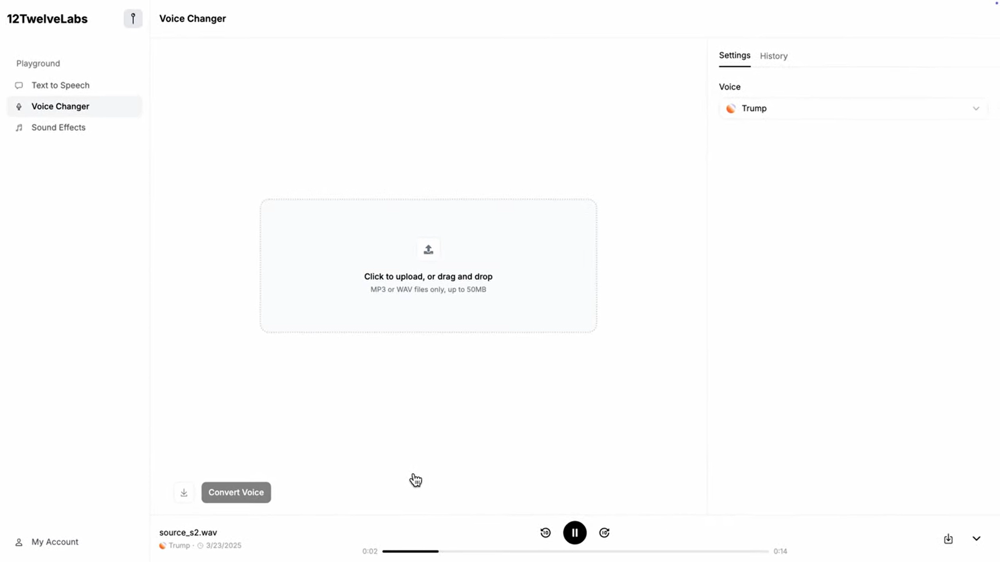

## Overview

Build a full-stack ElevenLabs clone with text-to-speech, voice conversion, and audio generation. Instead of external API services, self-host three AI models (StyleTTS2, Seed-VC, and Make-An-Audio) from GitHub, fine-tune them to specific voices, then containerize them with Docker and expose inference endpoints via FastAPI. The AI backend will be built using Python and PyTorch. Create a Next.js application where users can use the AI models to generate audio, and also switch between voices and view previously generated audio files, stored in an S3 bucket. The project includes user authentication, a credit system, and an Inngest queue to prevent overloading of the server hosting the AI models. The web application is built on the T3 Stack with Next.js, React, Tailwind, and Auth.js. 
Features:

- 🔊 Text-to-speech synthesis with StyleTTS2
- 🎭 Voice conversion with Seed-VC
- 🎵 Audio generation from text with Make-An-Audio
- 🤖 Custom voice fine-tuning capabilities
- 🐳 Docker containerization of AI models
- 🚀 FastAPI backend endpoints
- 📊 User credit management system
- 🔄 Inngest queue to prevent server overload
- 💾 AWS S3 for audio file storage
- 👥 Multiple pre-trained voice models
- 📱 Responsive Next.js web interface
- 🔐 User authentication with Auth.js
- 🎛️ Voice picker
- 📝 Generated audio history
- 🎨 Modern UI with Tailwind CSS

## Models Used in Video

- Voice-to-voice: [seed-vc](https://github.com/Plachtaa/seed-vc)
- Text-to-speech fine-tuning: [StyleTTS2FineTune](https://github.com/IIEleven11/StyleTTS2FineTune)
- Text-to-speech: [StyleTTS2](https://github.com/yl4579/StyleTTS2)
- Text-to-SFX: [Make-an-audio](https://github.com/Text-to-Audio/Make-An-Audio)

## Setup

Follow these steps to install and set up the project.

### Clone the Repository

```bash
git clone https://github.com/Akpan123/VoxNova.git
```

### Navigate to the Project Directory

```bash
cd elevenlabs-clone
```

### Install Python

Download and install Python if not already installed. Use the link below for guidance on installation:
[Python Download](https://www.python.org/downloads/)

Create a virtual environment for each folder, except elevenlabs-clone-frontend, with **Python 3.10**.

### Dependencies

Next.js frontend:

```bash
cd elevenlabs-clone-frontend
npm i
```

Folders with AI models:

```bash
cd seed-vc # For example
pip install -r requirements.txt
```

### IAM users and roles required

1. User: styletts2-api
   Required to upload audio files to an S3 bucket for voice conversion, and getting S3 items.

Add custom policy:

```
{
    "Version": "2012-10-17",
    "Statement": [
        {
            "Effect": "Allow",
            "Action": [
                "s3:PutObject",
                "s3:GetObject",
                "s3:ListBucket"
            ],
            "Resource": [
                "arn:aws:s3:::elevenlabs-clone",
                "arn:aws:s3:::elevenlabs-clone/*"
            ]
        }
    ]
}
```

2. Role: elevenlabs-clone-ec2
   Attach to an EC2 instance to be allowed to interact with S3 and ECR.

Permissions:

- AmazonEC2ContainerRegistryFullAccess
- AmazonS3FullAccess

Add custom policy:

```
{
	"Version": "2012-10-17",
	"Statement": [
		{
			"Effect": "Allow",
			"Action": [
				"s3:PutObject",
				"s3:GetObject",
				"s3:ListBucket"
			],
			"Resource": [
				"arn:aws:s3:::elevenlabs-clone",
				"arn:aws:s3:::elevenlabs-clone/*"
			]
		}
	]
}
```
